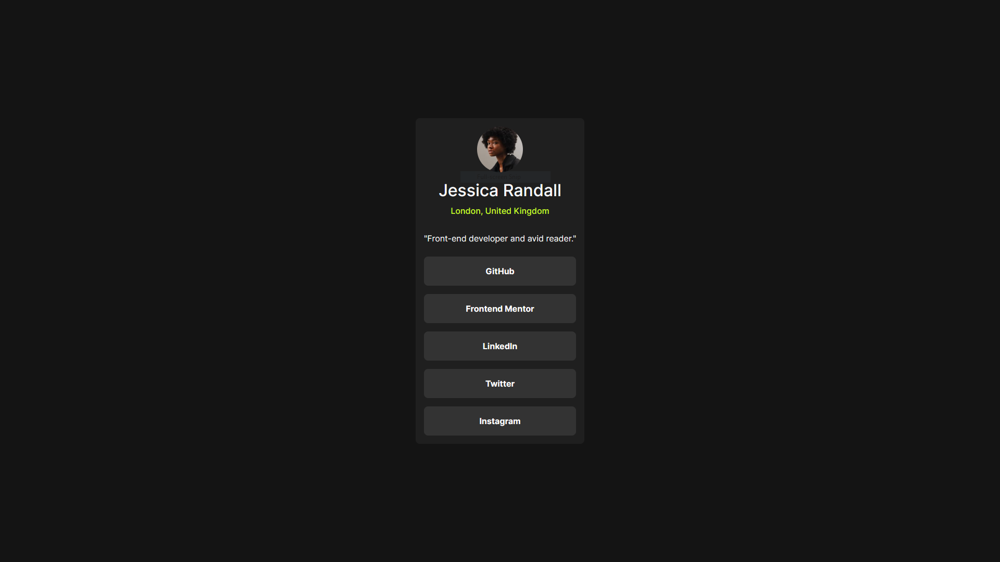

# Frontend Mentor - Social Links Profile

This is a solution to the [Social Links Profile challenge on Frontend Mentor](https://www.frontendmentor.io/challenges/social-links-profile-UG32l9m6dQ). Frontend Mentor challenges help you improve your coding skills by building realistic projects. 

## Sumário

- [Visão Geral](#visão-geral)
  - [Preview do Projeto](#preview-do-projeto)
  - [Links](#links)
- [Tecnologias](#tecnologias)

## Visão Geral

### Preview do Projeto

### Links

- Solution URL: [Solution URL from Github](https://github.com/gustavo-martins-pereira/Social_Links_Profile_with_Bootstrap)
- Live Site URL: [Live site URL](https://gustavo-martins-pereira.github.io/Social_Links_Profile_with_Bootstrap/)

## Tecnologias

    
    
    

